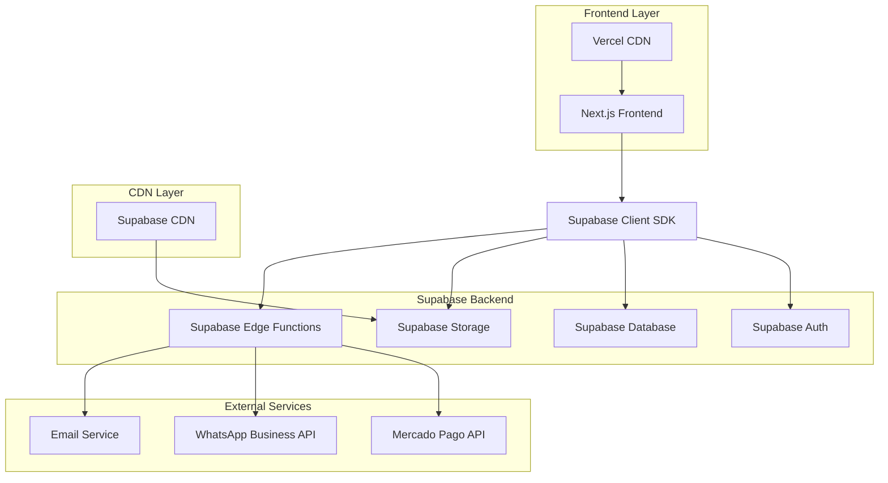

# 🏗️ Arquitetura Técnica - Marketplace com Supabase

## 1. Arquitetura Geral



---

## 2. Stack Tecnológico

### Frontend
- **Framework**: Next.js 14+ (App Router)
- **Linguagem**: TypeScript
- **Estilização**: Tailwind CSS
- **Estado**: Zustand + Supabase Client
- **Formulários**: React Hook Form + Zod
- **UI Components**: shadcn/ui
- **Imagens**: Next.js Image + Supabase Storage

### Backend (Supabase)
- **Database**: PostgreSQL (Supabase)
- **Authentication**: Supabase Auth
- **Storage**: Supabase Storage
- **API**: Supabase Edge Functions (Deno)
- **Real-time**: Supabase Realtime
- **Security**: Row Level Security (RLS)

### Integrações
- **Pagamentos**: Mercado Pago API
- **Comunicação**: WhatsApp Business API
- **Email**: Resend ou SendGrid
- **Analytics**: Google Analytics + Supabase Analytics

---

## 3. Estrutura de Rotas

| Rota | Propósito | Autenticação |
|------|-----------|-------------|
| `/` | Página inicial com produtos em destaque | Pública |
| `/produtos` | Listagem de produtos com filtros | Pública |
| `/produto/[slug]` | Detalhes do produto | Pública |
| `/loja/[slug]` | Página da loja | Pública |
| `/categorias` | Listagem de categorias | Pública |
| `/categoria/[slug]` | Produtos por categoria | Pública |
| `/auth/login` | Login de usuários | Pública |
| `/auth/register` | Cadastro de usuários | Pública |
| `/auth/forgot-password` | Recuperação de senha | Pública |
| `/perfil` | Perfil do usuário | Autenticada |
| `/carrinho` | Carrinho de compras | Pública |
| `/checkout` | Finalização de compra | Autenticada |
| `/pedidos` | Histórico de pedidos | Autenticada |
| `/seller/dashboard` | Dashboard do vendedor | Seller |
| `/seller/produtos` | Gestão de produtos | Seller |
| `/seller/pedidos` | Pedidos recebidos | Seller |
| `/seller/loja` | Configurações da loja | Seller |
| `/admin/dashboard` | Dashboard administrativo | Admin |
| `/admin/usuarios` | Gestão de usuários | Admin |
| `/admin/lojas` | Gestão de lojas | Admin |
| `/admin/categorias` | Gestão de categorias | Admin |
| `/planos` | Página de planos | Pública |
| `/assinatura` | Gestão de assinatura | Seller |

---

## 4. Definições de API (Edge Functions)

### 4.1 Autenticação e Usuários

#### Registro de Usuário
```typescript
POST /functions/v1/auth-register
```

**Request:**
| Campo | Tipo | Obrigatório | Descrição |
|-------|------|-------------|----------|
| email | string | true | Email do usuário |
| password | string | true | Senha (mín. 8 caracteres) |
| name | string | true | Nome completo |
| user_type | enum | true | BUYER, SELLER, ADMIN |
| phone | string | false | Telefone |
| city | string | false | Cidade |
| state | string | false | Estado |

**Response:**
```json
{
  "user": {
    "id": "uuid",
    "email": "user@email.com",
    "name": "Nome do Usuário",
    "user_type": "BUYER"
  },
  "session": {
    "access_token": "jwt_token",
    "refresh_token": "refresh_token"
  }
}
```

### 4.2 Gestão de Produtos

#### Criar Produto
```typescript
POST /functions/v1/products
```

**Request:**
| Campo | Tipo | Obrigatório | Descrição |
|-------|------|-------------|----------|
| name | string | true | Nome do produto |
| description | string | true | Descrição |
| price | number | true | Preço |
| category_id | uuid | true | ID da categoria |
| images | string[] | true | URLs das imagens |
| stock | number | true | Quantidade em estoque |
| specifications | object | false | Especificações técnicas |

**Response:**
```json
{
  "id": "uuid",
  "name": "Nome do Produto",
  "slug": "nome-do-produto",
  "price": 99.99,
  "created_at": "2024-01-01T00:00:00Z"
}
```

### 4.3 Sistema de Pagamentos

#### Criar Pagamento
```typescript
POST /functions/v1/create-payment
```

**Request:**
| Campo | Tipo | Obrigatório | Descrição |
|-------|------|-------------|----------|
| order_id | uuid | true | ID do pedido |
| payment_method | enum | true | PIX, CREDIT_CARD |
| amount | number | true | Valor total |
| buyer_email | string | true | Email do comprador |
| items | array | true | Itens do pedido |

**Response:**
```json
{
  "preference_id": "mp_preference_id",
  "init_point": "https://mercadopago.com/checkout",
  "qr_code": "base64_qr_code",
  "pix_code": "pix_copy_paste_code"
}
```

#### Webhook de Pagamento
```typescript
POST /functions/v1/payment-webhook
```

**Request (Mercado Pago):**
```json
{
  "type": "payment",
  "data": {
    "id": "payment_id"
  }
}
```

### 4.4 Sistema de Notificações

#### Enviar Notificação WhatsApp
```typescript
POST /functions/v1/whatsapp-notification
```

**Request:**
| Campo | Tipo | Obrigatório | Descrição |
|-------|------|-------------|----------|
| to | string | true | Número do WhatsApp |
| type | enum | true | text, template |
| message | string | true | Mensagem |
| template_name | string | false | Nome do template |
| template_params | array | false | Parâmetros do template |

**Response:**
```json
{
  "success": true,
  "message_id": "whatsapp_message_id"
}
```

### 4.5 Upload de Arquivos

#### Upload de Imagem
```typescript
POST /functions/v1/upload-image
```

**Request (FormData):**
| Campo | Tipo | Obrigatório | Descrição |
|-------|------|-------------|----------|
| file | File | true | Arquivo de imagem |
| bucket | string | true | products, stores, avatars |
| folder | string | false | Pasta de destino |

**Response:**
```json
{
  "url": "https://supabase.co/storage/v1/object/public/bucket/path",
  "path": "folder/filename.jpg",
  "size": 1024000
}
```

---

## 5. Modelo de Dados (Supabase)

### 5.1 Diagrama ER

```mermaid
erDiagram
    USERS ||--o{ SELLERS : has
    USERS ||--o{ ORDERS : places
    SELLERS ||--|| STORES : owns
    SELLERS ||--o{ PRODUCTS : creates
    STORES ||--o{ PRODUCTS : contains
    CATEGORIES ||--o{ PRODUCTS : categorizes
    PRODUCTS ||--o{ PRODUCT_IMAGES : has
    PRODUCTS ||--o{ ORDER_ITEMS : contains
    ORDERS ||--o{ ORDER_ITEMS : includes
    PLANS ||--o{ SUBSCRIPTIONS : defines
    USERS ||--o{ SUBSCRIPTIONS : subscribes

    USERS {
        uuid id PK
        string email UK
        string name
        string phone
        enum user_type
        string city
        string state
        string avatar
        boolean is_verified
        timestamp created_at
        timestamp updated_at
    }

    SELLERS {
        uuid id PK
        uuid user_id FK
        string store_name
        string store_description
        string store_slug UK
        string cnpj
        string address
        string zip_code
        string category
        enum plan
        boolean is_active
        decimal rating
        integer total_sales
        decimal commission
        timestamp created_at
        timestamp updated_at
    }

    STORES {
        uuid id PK
        uuid seller_id FK
        string name
        string slug UK
        string description
        string logo
        string banner
        string address
        string city
        string state
        string zip_code
        string phone
        string email
        string whatsapp
        string website
        jsonb social_media
        string category
        boolean is_active
        boolean is_verified
        decimal rating
        integer review_count
        integer product_count
        integer sales_count
        enum plan
        jsonb features
        jsonb theme
        string seo_title
        string seo_description
        timestamp created_at
        timestamp updated_at
    }

    CATEGORIES {
        uuid id PK
        string name
        string slug UK
        string description
        string image
        uuid parent_id FK
        boolean is_active
        integer order_index
        integer product_count
        timestamp created_at
    }

    PRODUCTS {
        uuid id PK
        uuid seller_id FK
        uuid store_id FK
        uuid category_id FK
        string name
        text description
        decimal price
        decimal compare_price
        string subcategory
        integer stock
        integer min_stock
        string sku
        decimal weight
        jsonb dimensions
        boolean is_active
        boolean is_featured
        text_array tags
        string seo_title
        text seo_description
        decimal rating
        integer review_count
        integer sales_count
        timestamp created_at
        timestamp updated_at
    }

    PRODUCT_IMAGES {
        uuid id PK
        uuid product_id FK
        string url
        string alt
        integer order_index
        boolean is_main
    }

    ORDERS {
        uuid id PK
        uuid buyer_id FK
        uuid seller_id FK
        uuid store_id FK
        decimal subtotal
        decimal shipping
        decimal tax
        decimal discount
        decimal total
        enum status
        enum payment_method
        enum payment_status
        jsonb shipping_address
        jsonb billing_address
        string tracking_code
        text notes
        timestamp created_at
        timestamp updated_at
    }

    ORDER_ITEMS {
        uuid id PK
        uuid order_id FK
        uuid product_id FK
        string product_name
        string product_image
        decimal price
        integer quantity
        decimal total
        jsonb specifications
    }

    PLANS {
        uuid id PK
        string name UK
        string slug UK
        text description
        decimal price
        string billing_period
        integer max_ads
        integer ad_duration
        integer max_photos
        string support
        text_array features
        boolean is_active
        integer order_index
        timestamp created_at
        timestamp updated_at
    }

    SUBSCRIPTIONS {
        uuid id PK
        uuid user_id FK
        uuid plan_id FK
        enum status
        timestamp start_date
        timestamp end_date
        boolean auto_renew
        string payment_method
        timestamp last_payment
        timestamp next_payment
        timestamp created_at
        timestamp updated_at
    }
```



### 5.2 Políticas de Segurança (RLS)

#### Usuários
```sql
-- Users can view their own profile
CREATE POLICY "users_select_own" ON public.users
    FOR SELECT USING (auth.uid() = id);

-- Users can update their own profile
CREATE POLICY "users_update_own" ON public.users
    FOR UPDATE USING (auth.uid() = id);
```

#### Produtos
```sql
-- Public can view active products
CREATE POLICY "products_select_active" ON public.products
    FOR SELECT USING (is_active = true);

-- Sellers can manage their own products
CREATE POLICY "products_manage_own" ON public.products
    FOR ALL USING (
        auth.uid() = (SELECT user_id FROM public.sellers WHERE id = seller_id)
    );

-- Admins can manage all products
CREATE POLICY "products_admin_all" ON public.products
    FOR ALL USING (
        auth.uid() IN (
            SELECT id FROM public.users WHERE user_type = 'ADMIN'
        )
    );
```

#### Pedidos
```sql
-- Users can view their own orders
CREATE POLICY "orders_select_own" ON public.orders
    FOR SELECT USING (
        auth.uid() = buyer_id OR 
        auth.uid() = (SELECT user_id FROM public.sellers WHERE id = seller_id)
    );

-- Buyers can create orders
CREATE POLICY "orders_insert_buyer" ON public.orders
    FOR INSERT WITH CHECK (auth.uid() = buyer_id);

-- Sellers can update order status
CREATE POLICY "orders_update_seller" ON public.orders
    FOR UPDATE USING (
        auth.uid() = (SELECT user_id FROM public.sellers WHERE id = seller_id)
    );
```

---

## 6. Configuração de Storage

### 6.1 Buckets

```sql
-- Create storage buckets
INSERT INTO storage.buckets (id, name, public) VALUES 
    ('products', 'products', true),
    ('stores', 'stores', true),
    ('avatars', 'avatars', true),
    ('documents', 'documents', false);
```

### 6.2 Políticas de Storage

```sql
-- Public can view product images
CREATE POLICY "product_images_select" ON storage.objects
    FOR SELECT USING (bucket_id = 'products');

-- Authenticated users can upload product images
CREATE POLICY "product_images_insert" ON storage.objects
    FOR INSERT WITH CHECK (
        bucket_id = 'products' AND 
        auth.role() = 'authenticated'
    );

-- Users can update their own uploads
CREATE POLICY "images_update_own" ON storage.objects
    FOR UPDATE USING (
        auth.uid()::text = (storage.foldername(name))[1]
    );

-- Users can delete their own uploads
CREATE POLICY "images_delete_own" ON storage.objects
    FOR DELETE USING (
        auth.uid()::text = (storage.foldername(name))[1]
    );
```

---

## 7. Configuração de Real-time

### 7.1 Publicações

```sql
-- Enable realtime for specific tables
ALTER PUBLICATION supabase_realtime ADD TABLE public.orders;
ALTER PUBLICATION supabase_realtime ADD TABLE public.products;
ALTER PUBLICATION supabase_realtime ADD TABLE public.notifications;
```

### 7.2 Filtros de Real-time

```typescript
// Subscribe to user's orders
const ordersSubscription = supabase
  .channel('user-orders')
  .on(
    'postgres_changes',
    {
      event: '*',
      schema: 'public',
      table: 'orders',
      filter: `buyer_id=eq.${userId}`
    },
    (payload) => {
      console.log('Order update:', payload)
    }
  )
  .subscribe()

// Subscribe to seller's products
const productsSubscription = supabase
  .channel('seller-products')
  .on(
    'postgres_changes',
    {
      event: '*',
      schema: 'public',
      table: 'products',
      filter: `seller_id=eq.${sellerId}`
    },
    (payload) => {
      console.log('Product update:', payload)
    }
  )
  .subscribe()
```

---

## 8. Configuração de Edge Functions

### 8.1 Estrutura de Pastas

```
supabase/
├── functions/
│   ├── create-payment/
│   │   └── index.ts
│   ├── payment-webhook/
│   │   └── index.ts
│   ├── create-subscription/
│   │   └── index.ts
│   ├── whatsapp-notification/
│   │   └── index.ts
│   ├── upload-image/
│   │   └── index.ts
│   └── _shared/
│       ├── cors.ts
│       ├── auth.ts
│       └── utils.ts
```

### 8.2 Utilitários Compartilhados

#### CORS Helper
**Arquivo**: `supabase/functions/_shared/cors.ts`

```typescript
export const corsHeaders = {
  'Access-Control-Allow-Origin': '*',
  'Access-Control-Allow-Headers': 'authorization, x-client-info, apikey, content-type',
  'Access-Control-Allow-Methods': 'GET, POST, PUT, DELETE, OPTIONS'
}

export const handleCors = (req: Request) => {
  if (req.method === 'OPTIONS') {
    return new Response('ok', { headers: corsHeaders })
  }
  return null
}
```

#### Auth Helper
**Arquivo**: `supabase/functions/_shared/auth.ts`

```typescript
import { createClient } from 'https://esm.sh/@supabase/supabase-js@2'

export const createSupabaseClient = () => {
  return createClient(
    Deno.env.get('SUPABASE_URL') ?? '',
    Deno.env.get('SUPABASE_SERVICE_ROLE_KEY') ?? ''
  )
}

export const getUser = async (req: Request) => {
  const authHeader = req.headers.get('Authorization')
  if (!authHeader) {
    throw new Error('No authorization header')
  }

  const token = authHeader.replace('Bearer ', '')
  const supabase = createSupabaseClient()
  
  const { data: { user }, error } = await supabase.auth.getUser(token)
  
  if (error || !user) {
    throw new Error('Invalid token')
  }
  
  return user
}
```

---

## 9. Monitoramento e Logs

### 9.1 Configuração de Logs

```typescript
// Log helper for Edge Functions
export const logger = {
  info: (message: string, data?: any) => {
    console.log(`[INFO] ${message}`, data ? JSON.stringify(data) : '')
  },
  error: (message: string, error?: any) => {
    console.error(`[ERROR] ${message}`, error)
  },
  warn: (message: string, data?: any) => {
    console.warn(`[WARN] ${message}`, data ? JSON.stringify(data) : '')
  }
}
```

### 9.2 Métricas de Performance

```sql
-- Create analytics table
CREATE TABLE public.analytics_events (
    id UUID DEFAULT uuid_generate_v4() PRIMARY KEY,
    event_type TEXT NOT NULL,
    page_url TEXT,
    product_id UUID,
    search_term TEXT,
    value DECIMAL(10,2),
    user_id UUID REFERENCES auth.users(id),
    session_id TEXT NOT NULL,
    user_agent TEXT,
    referrer TEXT,
    created_at TIMESTAMP WITH TIME ZONE DEFAULT NOW()
);

-- Create indexes for analytics
CREATE INDEX idx_analytics_events_type ON public.analytics_events(event_type);
CREATE INDEX idx_analytics_events_user ON public.analytics_events(user_id);
CREATE INDEX idx_analytics_events_date ON public.analytics_events(created_at);
CREATE INDEX idx_analytics_events_product ON public.analytics_events(product_id);
```

---

## 10. Deploy e CI/CD

### 10.1 GitHub Actions

**Arquivo**: `.github/workflows/deploy.yml`

```yaml
name: Deploy to Production

on:
  push:
    branches: [main]

jobs:
  deploy:
    runs-on: ubuntu-latest
    
    steps:
      - uses: actions/checkout@v3
      
      - name: Setup Node.js
        uses: actions/setup-node@v3
        with:
          node-version: '18'
          cache: 'npm'
      
      - name: Install dependencies
        run: npm ci
      
      - name: Build project
        run: npm run build
        env:
          NEXT_PUBLIC_SUPABASE_URL: ${{ secrets.SUPABASE_URL }}
          NEXT_PUBLIC_SUPABASE_ANON_KEY: ${{ secrets.SUPABASE_ANON_KEY }}
      
      - name: Deploy to Vercel
        uses: amondnet/vercel-action@v25
        with:
          vercel-token: ${{ secrets.VERCEL_TOKEN }}
          vercel-org-id: ${{ secrets.VERCEL_ORG_ID }}
          vercel-project-id: ${{ secrets.VERCEL_PROJECT_ID }}
          vercel-args: '--prod'
      
      - name: Deploy Supabase Functions
        run: |
          npm install -g supabase
          supabase functions deploy --project-ref ${{ secrets.SUPABASE_PROJECT_REF }}
        env:
          SUPABASE_ACCESS_TOKEN: ${{ secrets.SUPABASE_ACCESS_TOKEN }}
```

### 10.2 Scripts de Deploy

**Arquivo**: `package.json`

```json
{
  "scripts": {
    "dev": "next dev",
    "build": "next build",
    "start": "next start",
    "lint": "next lint",
    "supabase:start": "supabase start",
    "supabase:stop": "supabase stop",
    "supabase:reset": "supabase db reset",
    "supabase:push": "supabase db push",
    "supabase:deploy": "supabase functions deploy",
    "migrate:supabase": "tsx scripts/migrate-to-supabase.ts",
    "deploy:prod": "npm run build && vercel --prod && npm run supabase:deploy"
  }
}
```

---

**📋 RESUMO DA ARQUITETURA**

Esta arquitetura técnica fornece:

✅ **Escalabilidade**: Supabase gerencia automaticamente scaling
✅ **Segurança**: RLS, JWT, HTTPS por padrão
✅ **Performance**: CDN global, Edge Functions
✅ **Real-time**: Sincronização automática de dados
✅ **Backup**: Backup automático e point-in-time recovery
✅ **Monitoramento**: Logs detalhados e métricas
✅ **Deploy**: CI/CD automatizado

**Status**: Pronto para implementação
**Complexidade**: Média-Alta
**Tempo estimado**: 8-12 semanas

---

*Documento técnico criado para o projeto Vendeu Online*
*Versão: 1.0*
*Data: Janeiro 2024*