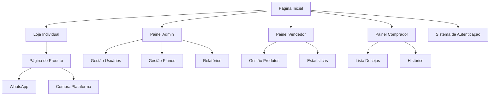

# Documentação Completa - Vendeu Online

**Domínio:** vendeu.online  
**Região de Atendimento:** Erechim-RS  
**Email Admin:** grupomaboon@gmail.com  
**Cores da Marca:** Azul e Roxo

## 1. Visão Geral do Projeto

Vendeu Online é uma plataforma completa de classificados e marketplace que conecta compradores e vendedores na região de Erechim-RS, oferecendo uma experiência de compra segura e intuitiva com foco em transações locais.

- **Objetivo Principal**: Facilitar transações entre múltiplos vendedores e compradores em uma única plataforma integrada focada na região de Erechim-RS
- **Público-Alvo**: Administradores de plataforma, vendedores/lojistas locais e compradores da região
- **Valor de Mercado**: Solução regional preparada para expansões futuras com funcionalidades específicas para classificados locais e e-commerce regional

## 2. Funcionalidades Principais

### 2.1 Perfis de Usuário

| Perfil | Método de Cadastro | Permissões Principais |
|--------|-------------------|----------------------|
| Administrador | Acesso direto via sistema | Gestão completa da plataforma, usuários, planos, relatórios e configurações |
| Vendedor | Cadastro via e-mail + aprovação admin | Gestão de produtos, loja própria, catálogo, pedidos e estatísticas |
| Comprador | Cadastro livre via e-mail | Navegação, lista de desejos, histórico, favoritos e filtros regionais |

### 2.2 Módulos Funcionais

Nossa plataforma Vendeu Online consiste nas seguintes páginas principais:

1. **Página Inicial**: seção hero com busca, categorias de classificados, anúncios em destaque
2. **Página de Categoria**: listagem de produtos por categoria (Eletrônicos, Imóveis, Veículos, Roupas, Comida, Serviços, Emprego, Móveis)
3. **Página de Produto**: detalhes do anúncio, informações do vendedor, contato
4. **Página de Vendedor**: perfil do vendedor, seus anúncios, avaliações
5. **Painel do Vendedor**: gerenciamento de anúncios, planos, estatísticas
6. **Página de Planos**: planos de assinatura para vendedores
7. **Página de Contato**: formulário de contato e informações da empresa
8. **Sistema de Autenticação**: login, cadastro, recuperação de senha, verificação de e-mail

### 2.3 Detalhamento das Funcionalidades

| Página | Módulo | Descrição da Funcionalidade |
|--------|--------|-----------------------------|
| Página Inicial | Hero Section | Exibir banner principal com busca centralizada, categorias de classificados e anúncios em destaque |
| Página Inicial | Categorias Principais | Mostrar 8 categorias: Eletrônicos, Imóveis, Veículos, Roupas, Comida, Serviços, Emprego, Móveis |
| Página Inicial | Anúncios em Destaque | Grid responsivo de anúncios com filtros por região Erechim-RS, preço e categoria |
| Página de Categoria | Listagem de Anúncios | Exibir anúncios da categoria selecionada com paginação e filtros |
| Página de Categoria | Filtros Avançados | Permitir filtrar por preço, localização, condição do produto, data de publicação |
| Página de Produto | Detalhes do Anúncio | Mostrar informações completas, galeria de imagens, preço, descrição |
| Página de Produto | Informações do Vendedor | Exibir perfil do vendedor, avaliações, outros anúncios, formas de contato |
| Página de Produto | Ações de Contato | Botões para WhatsApp, telefone, email e formulário de interesse |
| Página de Vendedor | Perfil Público | Mostrar informações do vendedor, avaliações, histórico de vendas |
| Página de Vendedor | Anúncios Ativos | Listar todos os anúncios do vendedor com status e estatísticas |
| Painel Vendedor | Gestão de Anúncios | Criar, editar, pausar, renovar anúncios conforme plano contratado |
| Painel Vendedor | Planos e Assinatura | Visualizar plano atual, upgrade, histórico de pagamentos |
| Painel Vendedor | Estatísticas | Views dos anúncios, contatos recebidos, conversões |
| Página de Planos | Planos Disponíveis | Exibir 4 planos: Básico (R$29,90), Profissional (R$59,90), Premium (R$99,90), Empresarial (R$199,90) |
| Página de Planos | Comparativo | Tabela comparativa de recursos, limites de anúncios e benefícios |
| Página de Contato | Formulário | Formulário de contato para suporte e informações |
| Página de Contato | Informações | Dados da empresa, endereço em Erechim-RS, telefone, email grupomaboon@gmail.com |
| Sistema de Auth | Login/Cadastro | Autenticação com email grupomaboon@gmail.com para admin |
| Sistema de Auth | Perfis de Usuário | Diferentes níveis: admin, vendedor, comprador com permissões específicas |
| Sistema PWA | Instalação Mobile | Botão "Adicionar à Tela Inicial" com ícone e splash screen personalizados |
| Analytics | Tracking Avançado | Integração Meta Pixel, GA4 e GTM com eventos personalizados |

## 3. Fluxos Principais do Sistema

### Fluxo do Administrador
O administrador acessa o painel principal onde pode gerenciar todos os aspectos da plataforma: aprovar novos vendedores, criar e editar planos de cobrança, visualizar relatórios financeiros, gerenciar banners publicitários e configurar parâmetros gerais do sistema.

### Fluxo do Vendedor
O vendedor se cadastra na plataforma, aguarda aprovação do administrador, configura sua loja personalizada, cadastra produtos com imagens e descrições, define áreas de atuação e modalidades de frete, e monitora performance através de estatísticas detalhadas.

### Fluxo do Comprador
O comprador navega pela plataforma Vendeu Online, utiliza filtros regionais para encontrar anúncios em Erechim-RS, visualiza perfis dos vendedores, adiciona anúncios à lista de desejos, e entra em contato via WhatsApp, telefone ou formulário de interesse.



## 4. Design e Interface do Usuário

### 4.1 Estilo de Design

- **Cores Primárias**: #3B82F6 (azul principal), #8B5CF6 (roxo principal)
- **Cores Secundárias**: #F3F4F6 (cinza claro), #374151 (cinza escuro), #EDE9FE (roxo claro)
- **Gradientes**: Azul para roxo (#3B82F6 → #8B5CF6) em elementos de destaque
- **Estilo de Botões**: Rounded corners (8px), gradientes azul-roxo, hover effects suaves
- **Tipografia**: Inter (títulos), Open Sans (corpo), tamanhos 14px-32px
- **Layout**: Card-based design, navegação top fixa, sidebar responsiva
- **Ícones**: Heroicons e Lucide React para consistência visual

### 4.2 Visão Geral das Páginas

| Página | Módulo | Elementos de UI |
|--------|--------|----------------|
| Página Inicial | Hero Section | Banner principal com busca centralizada, gradiente azul-roxo, CTA destacado |
| Página Inicial | Grid de Produtos | Cards responsivos 4x3 desktop, 2x2 tablet, 1x1 mobile com lazy loading |
| Loja Individual | Header Personalizado | Logo do vendedor, cores customizáveis, informações de contato |
| Loja Individual | Catálogo de Produtos | Grid adaptativo com filtros laterais, ordenação e paginação |
| Painéis Admin/Vendedor | Dashboard | Métricas em cards, gráficos interativos, tabelas com DataTables |
| Painéis Admin/Vendedor | Formulários | Inputs com validação em tempo real, upload drag-and-drop |
| Mobile/PWA | Interface Touch | Botões maiores (44px mínimo), gestos swipe, navegação bottom tabs |

### 4.3 Responsividade

Design mobile-first com breakpoints: 320px (mobile), 768px (tablet), 1024px (desktop), 1440px (large desktop). Otimização para touch com elementos interativos de pelo menos 44px, navegação adaptativa e performance otimizada para conexões lentas.

## 5. Arquitetura Técnica

### 5.1 Stack Tecnológico

**Frontend:**
- Next.js 14+ (App Router)
- TypeScript
- Tailwind CSS
- Zustand (gerenciamento de estado)
- React Hook Form + Zod (formulários e validação)
- Next-PWA (Progressive Web App)

**Backend:**
- Node.js + NestJS
- TypeScript
- PostgreSQL + Prisma ORM
- JWT + bcrypt (autenticação)
- Cloudinary (upload de imagens)
- Redis (cache e sessões)

**Infraestrutura:**
- Vercel (frontend)
- Render.com ou VPS (backend)
- PostgreSQL Cloud (banco)
- CDN para assets estáticos

### 5.2 Estrutura de Pastas

```
marketplace-multivendedor/
├── frontend/
│   ├── src/
│   │   ├── app/
│   │   │   ├── (auth)/
│   │   │   │   ├── login/
│   │   │   │   └── register/
│   │   │   ├── admin/
│   │   │   │   ├── dashboard/
│   │   │   │   ├── users/
│   │   │   │   ├── plans/
│   │   │   │   └── banners/
│   │   │   ├── seller/
│   │   │   │   ├── dashboard/
│   │   │   │   ├── products/
│   │   │   │   ├── store/
│   │   │   │   └── analytics/
│   │   │   ├── buyer/
│   │   │   │   ├── dashboard/
│   │   │   │   ├── wishlist/
│   │   │   │   └── history/
│   │   │   ├── store/
│   │   │   │   └── [subdomain]/
│   │   │   ├── product/
│   │   │   │   └── [id]/
│   │   │   ├── api/
│   │   │   │   ├── auth/
│   │   │   │   ├── products/
│   │   │   │   ├── stores/
│   │   │   │   └── analytics/
│   │   │   ├── globals.css
│   │   │   ├── layout.tsx
│   │   │   └── page.tsx
│   │   ├── components/
│   │   │   ├── ui/
│   │   │   │   ├── Button.tsx
│   │   │   │   ├── Input.tsx
│   │   │   │   ├── Modal.tsx
│   │   │   │   └── Card.tsx
│   │   │   ├── layout/
│   │   │   │   ├── Header.tsx
│   │   │   │   ├── Sidebar.tsx
│   │   │   │   └── Footer.tsx
│   │   │   ├── forms/
│   │   │   │   ├── ProductForm.tsx
│   │   │   │   ├── StoreForm.tsx
│   │   │   │   └── UserForm.tsx
│   │   │   └── features/
│   │   │       ├── auth/
│   │   │       ├── products/
│   │   │       ├── stores/
│   │   │       └── analytics/
│   │   ├── lib/
│   │   │   ├── auth.ts
│   │   │   ├── db.ts
│   │   │   ├── utils.ts
│   │   │   └── validations.ts
│   │   ├── hooks/
│   │   │   ├── useAuth.ts
│   │   │   ├── useProducts.ts
│   │   │   └── useAnalytics.ts
│   │   ├── store/
│   │   │   ├── authStore.ts
│   │   │   ├── productStore.ts
│   │   │   └── uiStore.ts
│   │   └── types/
│   │       ├── auth.ts
│   │       ├── product.ts
│   │       └── store.ts
│   ├── public/
│   │   ├── icons/
│   │   ├── images/
│   │   └── manifest.json
│   ├── package.json
│   ├── tailwind.config.js
│   ├── next.config.js
│   └── tsconfig.json
├── backend/
│   ├── src/
│   │   ├── modules/
│   │   │   ├── auth/
│   │   │   │   ├── auth.controller.ts
│   │   │   │   ├── auth.service.ts
│   │   │   │   ├── auth.module.ts
│   │   │   │   └── dto/
│   │   │   ├── users/
│   │   │   │   ├── users.controller.ts
│   │   │   │   ├── users.service.ts
│   │   │   │   ├── users.module.ts
│   │   │   │   └── dto/
│   │   │   ├── products/
│   │   │   │   ├── products.controller.ts
│   │   │   │   ├── products.service.ts
│   │   │   │   ├── products.module.ts
│   │   │   │   └── dto/
│   │   │   ├── stores/
│   │   │   │   ├── stores.controller.ts
│   │   │   │   ├── stores.service.ts
│   │   │   │   ├── stores.module.ts
│   │   │   │   └── dto/
│   │   │   ├── payments/
│   │   │   │   ├── payments.controller.ts
│   │   │   │   ├── payments.service.ts
│   │   │   │   ├── payments.module.ts
│   │   │   │   └── dto/
│   │   │   ├── analytics/
│   │   │   │   ├── analytics.controller.ts
│   │   │   │   ├── analytics.service.ts
│   │   │   │   ├── analytics.module.ts
│   │   │   │   └── dto/
│   │   │   └── banners/
│   │   │       ├── banners.controller.ts
│   │   │       ├── banners.service.ts
│   │   │       ├── banners.module.ts
│   │   │       └── dto/
│   │   ├── common/
│   │   │   ├── guards/
│   │   │   │   ├── auth.guard.ts
│   │   │   │   └── roles.guard.ts
│   │   │   ├── decorators/
│   │   │   │   ├── roles.decorator.ts
│   │   │   │   └── user.decorator.ts
│   │   │   ├── filters/
│   │   │   │   └── http-exception.filter.ts
│   │   │   ├── interceptors/
│   │   │   │   └── logging.interceptor.ts
│   │   │   └── pipes/
│   │   │       └── validation.pipe.ts
│   │   ├── database/
│   │   │   ├── migrations/
│   │   │   ├── seeds/
│   │   │   └── schema.prisma
│   │   ├── config/
│   │   │   ├── database.config.ts
│   │   │   ├── jwt.config.ts
│   │   │   └── app.config.ts
│   │   ├── utils/
│   │   │   ├── encryption.ts
│   │   │   ├── file-upload.ts
│   │   │   └── email.ts
│   │   ├── app.module.ts
│   │   └── main.ts
│   ├── package.json
│   ├── tsconfig.json
│   └── nest-cli.json
├── docs/
│   ├── api/
│   │   ├── auth.md
│   │   ├── products.md
│   │   └── stores.md
│   ├── deployment/
│   │   ├── frontend.md
│   │   └── backend.md
│   └── development/
│       ├── setup.md
│       └── guidelines.md
├── scripts/
│   ├── setup.sh
│   ├── deploy.sh
│   └── backup.sh
├── .env.example
├── .gitignore
├── docker-compose.yml
└── README.md
```

## 6. Modelo de Dados

### 6.1 Entidades Principais

**Users (Usuários)**
- id, email, password, name, role, status, region, created_at, updated_at
- Relacionamentos: stores (1:N), ads (1:N), wishlists (1:N)

**Stores (Lojas/Perfis de Vendedor)**
- id, user_id, name, description, logo, banner, phone, whatsapp, settings, created_at
- Relacionamentos: ads (1:N), subscriptions (1:N)

**Ads (Anúncios/Classificados)**
- id, store_id, title, description, price, images, category, condition, location, status, created_at
- Categorias: Eletrônicos, Imóveis, Veículos, Roupas, Comida, Serviços, Emprego, Móveis
- Relacionamentos: wishlist_items (1:N), contacts (1:N)

**Orders (Pedidos)**
- id, user_id, store_id, total, status, shipping_info, created_at
- Relacionamentos: order_items (1:N)

**Plans (Planos)**
- id: serial primary key
- name: varchar (Básico, Profissional, Premium, Empresarial)
- price: decimal (29.90, 59.90, 99.90, 199.90)
- ads_limit: integer (limite de anúncios por plano)
- features: jsonb (recursos inclusos)
- duration: integer (30 dias)
- status: varchar
- created_at: timestamp
- Relacionamentos: subscriptions (1:N)

**Banners (Banners Publicitários)**
- id, title, image, link, position, start_date, end_date, status, created_at

### 6.2 Schema do Banco de Dados

```sql
-- Tabela de usuários
CREATE TABLE users (
  id SERIAL PRIMARY KEY,
  email VARCHAR(255) UNIQUE NOT NULL,
  password VARCHAR(255) NOT NULL,
  name VARCHAR(255) NOT NULL,
  role VARCHAR(50) DEFAULT 'buyer',
  status VARCHAR(50) DEFAULT 'active',
  created_at TIMESTAMP DEFAULT NOW(),
  updated_at TIMESTAMP DEFAULT NOW()
);

-- Tabela de lojas
CREATE TABLE stores (
  id SERIAL PRIMARY KEY,
  user_id INTEGER REFERENCES users(id),
  name VARCHAR(255) NOT NULL,
  subdomain VARCHAR(100) UNIQUE,
  description TEXT,
  logo VARCHAR(500),
  banner VARCHAR(500),
  settings JSONB,
  created_at TIMESTAMP DEFAULT NOW()
);

-- Tabela de produtos
CREATE TABLE products (
  id SERIAL PRIMARY KEY,
  store_id INTEGER REFERENCES stores(id),
  name VARCHAR(255) NOT NULL,
  description TEXT,
  price DECIMAL(10,2) NOT NULL,
  images JSONB,
  category VARCHAR(100),
  stock INTEGER DEFAULT 0,
  status VARCHAR(50) DEFAULT 'active',
  created_at TIMESTAMP DEFAULT NOW()
);
```

## 7. Etapas de Desenvolvimento

### 7.1 Fase 1: Fundação (Semanas 1-2)
- Configuração do ambiente de desenvolvimento
- Setup do projeto Next.js e NestJS
- Configuração do banco PostgreSQL
- Sistema de autenticação básico
- Estrutura de pastas e arquitetura inicial

### 7.2 Fase 2: Core Features (Semanas 3-5)
- CRUD de usuários e perfis
- Sistema de lojas e subdomínios
- CRUD de produtos com upload de imagens
- Página inicial com busca e filtros
- Painéis básicos (admin, vendedor, comprador)

### 7.3 Fase 3: Funcionalidades Avançadas (Semanas 6-8)
- Sistema de filtros regionais
- Integração WhatsApp
- Sistema de banners publicitários
- Analytics e relatórios
- Gestão de estoque avançada

### 7.4 Fase 4: PWA e Otimizações (Semanas 9-10)
- Configuração PWA completa
- Integração Meta Pixel e GA4
- Otimizações de performance
- Sistema de cache
- Testes e correções

### 7.5 Fase 5: Deploy e Produção (Semanas 11-12)
- Configuração de produção
- Deploy Vercel + Render
- Configuração de domínios
- Monitoramento e logs
- Documentação final

## 8. Integrações Externas

### 8.1 Pagamentos
- **Mercado Pago**: Checkout transparente, PIX, cartões (integração futura)
- **Stripe**: Pagamentos de assinaturas dos vendedores
- **PIX**: Pagamento direto entre comprador e vendedor
- **Boleto**: Opção para assinaturas de planos
- **Webhooks**: Confirmação automática de pagamentos de planos

### 8.2 Analytics e Marketing
- **Meta Pixel**: Tracking de conversões Facebook/Instagram
- **Google Analytics 4**: Análise de comportamento detalhada
- **Google Tag Manager**: Gerenciamento centralizado de tags

### 8.3 Comunicação
- **WhatsApp Business API**: Integração para compras diretas
- **SendGrid/Mailgun**: Envio de e-mails transacionais
- **SMS**: Notificações via SMS (futuro)

### 8.4 Logística (Futuro)
- **Melhor Envio**: Cálculo e contratação de fretes
- **Correios API**: Rastreamento de encomendas
- **Loggi/Rappi**: Entregas expressas

## 9. Segurança e Performance

### 9.1 Medidas de Segurança
- Autenticação JWT com refresh tokens
- Criptografia bcrypt para senhas
- Rate limiting nas APIs
- Validação de inputs com Zod
- CORS configurado adequadamente
- Headers de segurança (HTTPS, CSP, etc.)

### 9.2 Otimizações de Performance
- Server-side rendering (SSR) com Next.js
- Cache Redis para consultas frequentes
- Lazy loading de imagens
- Compressão de assets
- CDN para arquivos estáticos
- Database indexing otimizado

## 10. Monitoramento e Manutenção

### 10.1 Logs e Monitoramento
- Winston para logs estruturados
- Sentry para tracking de erros
- Uptime monitoring
- Performance monitoring
- Database monitoring

### 10.2 Backup e Recuperação
- Backup automático diário do PostgreSQL
- Versionamento de código com Git
- Backup de imagens no Cloudinary
- Plano de recuperação de desastres

### 10.3 Atualizações e Melhorias
- Atualizações de segurança mensais
- Monitoramento de dependências
- Testes automatizados
- Deploy contínuo com rollback
- Feedback dos usuários e melhorias iterativas

Esta documentação serve como guia completo para o desenvolvimento, implementação e manutenção da plataforma de marketplace multivendedor, garantindo que todos os aspectos técnicos e funcionais estejam devidamente documentados e organizados.