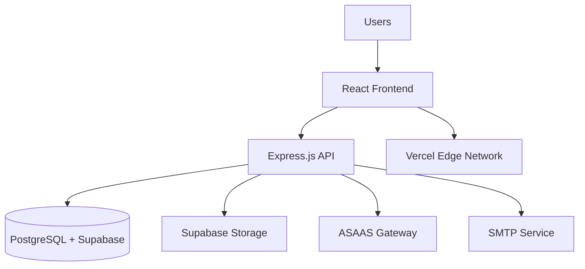
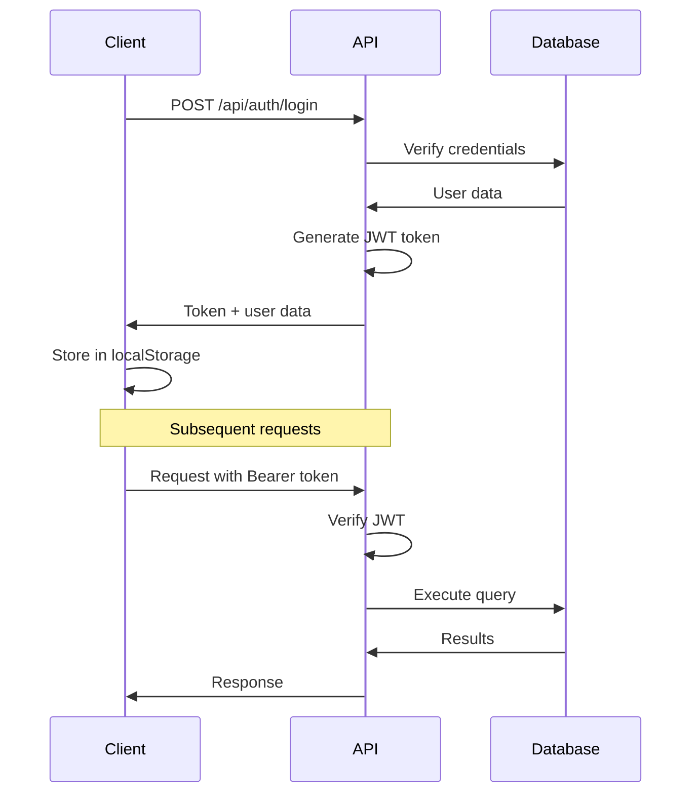
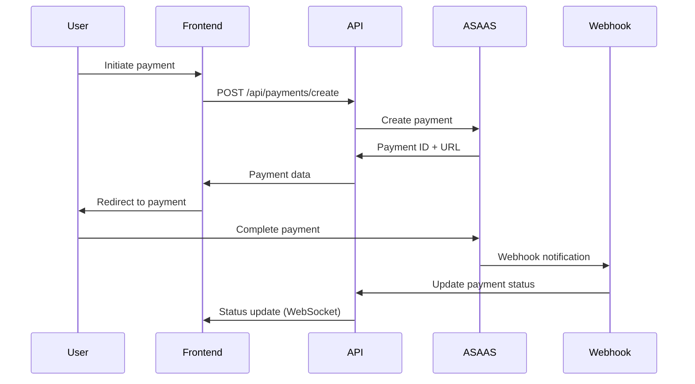

# 🏗️ Architecture Overview - Vendeu Online

This document provides a comprehensive overview of the Vendeu Online marketplace architecture.

## System Architecture



## Technology Stack

### Frontend Layer
- **Framework**: React 18 with TypeScript
- **Build Tool**: Vite (HMR, optimized bundling)
- **Routing**: React Router v6 with lazy loading
- **State Management**: Zustand with persistence
- **UI Framework**: Tailwind CSS + Radix UI primitives
- **Forms**: React Hook Form + Zod validation
- **PWA**: Vite PWA plugin with service workers

### Backend Layer
- **Runtime**: Node.js with Express.js
- **Database ORM**: Prisma with PostgreSQL
- **Authentication**: JWT tokens + bcryptjs hashing
- **File Upload**: Supabase Storage + Cloudinary fallback
- **Payment**: ASAAS (Brazilian gateway)
- **Email**: SMTP integration
- **Security**: Helmet, CORS, Rate limiting

### Database Layer
- **Primary**: Supabase PostgreSQL (cloud)
- **ORM**: Prisma with type-safe queries
- **Migrations**: Prisma migrate
- **Admin**: Prisma Studio GUI

### Infrastructure
- **Hosting**: Vercel (Frontend + Serverless functions)
- **CDN**: Vercel Edge Network
- **Database**: Supabase (managed PostgreSQL)
- **Storage**: Supabase Storage buckets
- **Monitoring**: Vercel Analytics + Supabase logs

## Data Models

### Core Entities

```typescript
// User Management
User {
  id: string
  email: string
  password: string (hashed)
  type: UserType (buyer|seller|admin)
  asaasCustomerId?: string
}

Seller {
  userId: string
  storeName: string
  storeDescription: string
  subscriptionId?: string
}

// Product Catalog
Store {
  id: string
  sellerId: string
  name: string
  description: string
  isActive: boolean
}

Product {
  id: string
  storeId: string
  name: string
  description: string
  price: decimal
  comparePrice?: decimal
  category: string
  images: ProductImage[]
  specifications: json
  isActive: boolean
  isFeatured: boolean
}

// Order Management
Order {
  id: string
  buyerId: string
  items: OrderItem[]
  total: decimal
  status: OrderStatus
  paymentId: string
  asaasPaymentId?: string
}

// Subscription System
Plan {
  id: string
  name: string
  price: decimal
  features: json
  maxProducts: number
  maxPhotos: number
}

Subscription {
  id: string
  userId: string
  planId: string
  status: SubscriptionStatus
  startDate: datetime
  endDate: datetime
}
```

## API Architecture

### Route Structure

```
/api/
├── auth/              # Authentication endpoints
├── users/             # User management
├── stores/            # Store operations
├── products/          # Product CRUD
├── orders/            # Order processing
├── payments/          # Payment handling
├── plans/             # Subscription plans
├── admin/             # Admin operations
├── upload/            # File upload
└── webhooks/          # External integrations
```

### Authentication Flow



## State Management

### Zustand Stores

```typescript
// Authentication State
authStore: {
  user: User | null
  token: string | null
  login: (credentials) => Promise<void>
  logout: () => void
  isAuthenticated: boolean
}

// Shopping Cart
cartStore: {
  items: CartItem[]
  addItem: (product, quantity) => void
  removeItem: (productId) => void
  updateQuantity: (productId, quantity) => void
  total: number
  itemCount: number
}

// Product Management
productStore: {
  products: Product[]
  fetchProducts: (filters?) => Promise<void>
  searchProducts: (query) => Promise<void>
  categories: Category[]
}
```

## Security Architecture

### Authentication & Authorization
- JWT tokens with secure signing
- Password hashing with bcryptjs (10 rounds)
- Role-based access control (RBAC)
- Route protection middleware

### Data Security
- Input validation with Zod schemas
- SQL injection protection via Prisma ORM
- XSS prevention with sanitization
- CSRF tokens for state-changing operations

### Infrastructure Security
- HTTPS enforcement
- Rate limiting (100 requests/15min)
- Helmet.js security headers
- CORS configuration
- Environment variable encryption

## Payment Architecture

### ASAAS Integration



### Supported Payment Methods
- **PIX**: Instant Brazilian payments
- **Boleto**: Bank slip payments
- **Credit Card**: Visa, Mastercard, Elo
- **Installments**: Up to 12x for credit cards

## File Storage Architecture

### Supabase Storage
- **Buckets**: products, stores, avatars
- **Security**: Row Level Security (RLS)
- **CDN**: Global edge distribution
- **Formats**: WebP optimization, multiple sizes

### Upload Flow
```typescript
// Client-side upload
const uploadFile = async (file: File) => {
  const { data, error } = await supabase.storage
    .from('products')
    .upload(`${userId}/${uuid()}.webp`, file)

  return data?.path
}
```

## Performance Optimizations

### Frontend
- **Code Splitting**: Route-based lazy loading
- **Virtual Lists**: Large product catalogs
- **Image Lazy Loading**: Intersection Observer API
- **PWA Caching**: Service worker strategies
- **Bundle Optimization**: Tree shaking, minification

### Backend
- **Database Indexing**: Optimized queries
- **Connection Pooling**: Supabase pgBouncer
- **Rate Limiting**: Protection against abuse
- **Response Compression**: Gzip compression
- **Caching**: Redis for session data

### Database
- **Query Optimization**: Prisma query analyzer
- **Indexes**: Strategic B-tree indexes
- **Connection Limits**: Pool size management
- **Read Replicas**: Horizontal scaling ready

## Monitoring & Observability

### Application Monitoring
- **Error Tracking**: Custom error boundaries
- **Performance**: Vercel Analytics
- **API Metrics**: Response times, error rates
- **User Analytics**: Page views, conversions

### Database Monitoring
- **Supabase Dashboard**: Query performance
- **Connection Monitoring**: Pool utilization
- **Storage Metrics**: Bucket usage
- **Slow Query Log**: Performance bottlenecks

## Scalability Considerations

### Horizontal Scaling
- **Stateless API**: Serverless-ready architecture
- **Database Sharding**: User-based partitioning
- **CDN Distribution**: Global asset delivery
- **Microservices**: Service decomposition ready

### Vertical Scaling
- **Database Sizing**: CPU/RAM optimization
- **Connection Pooling**: Efficient resource usage
- **Caching Layers**: Redis implementation
- **Load Balancing**: Multi-instance deployment

---

For implementation details, see:
- [Backend Fixes Summary](./BACKEND-FIXES-SUMMARY.md)
- [Tracking Pixels Guide](./TRACKING-PIXELS-GUIDE.md)
- [API Reference](../api/API_REFERENCE.md)